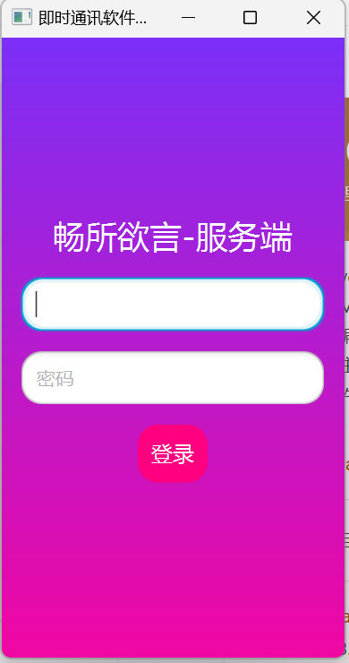
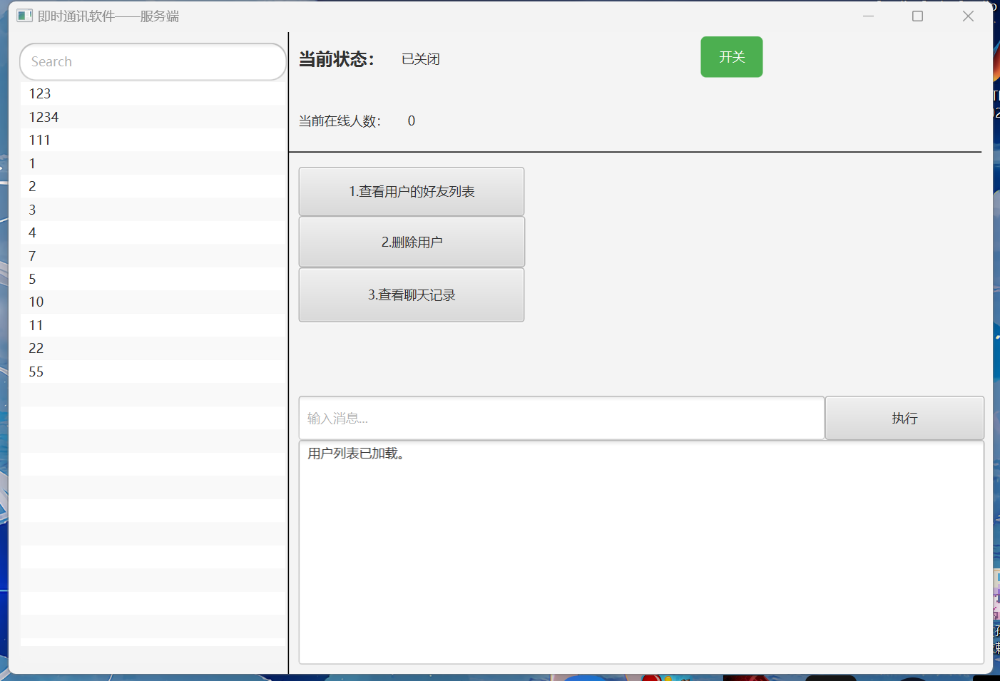
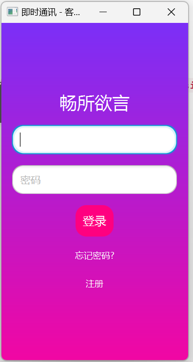
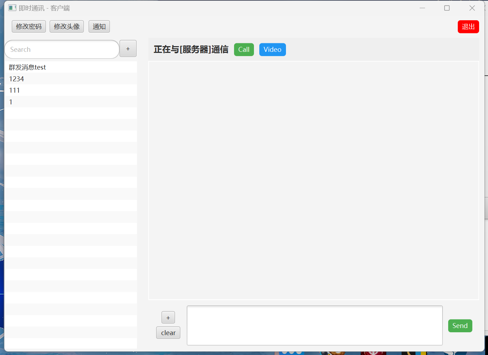

# instant_messenger_with_java
- **项目名称**：基于Java的即时通讯软件（畅所欲言）\
  一个类似于QQ的即时通讯软件，涉及到服务端和客户端的设计、网络协议的实现、消息暂时存储与转发、用户管理等多个方面。\
- **项目作者**：刘楷20234001037、罗森20234001065、凌子健20234001055、杨冬20234001085
- **注意事项**：\
  程序是基于Java17开发的\
  启动程序之前需要先将项目中libs中的jar包Add to Build Path\
  启动客户端之前需要先启动服务端\
  使用IDE创建项目时，应该选择JavaFX项目\
  请先查看第二部分的安装与使用

  
### 项目目标

1. **用户管理**：实现用户注册、登录、添加好友等功能。
2. **消息管理**：支持文本、文件的即时发送和接收、暂时只完成了暂时存储消息，可扩展数据库或本地文件实现长时间存储。
3. **聊天管理**：支持一对一聊天，以及群聊聊天（暂时完成了一个测试群，可扩展加入群聊、退出群聊等功能）。

   
### 一、项目架构设计

1. **服务端**
   - 数据库：MySQL
   - 多线程
   - 文件及消息转发
   - 服务端主要负责用户的注册、登录、认证、消息转发、好友管理等功能。
   - 使用数据库来存储用户信息、聊天记录（暂未实现）等。
   

3. **客户端**
   - **桌面端**：JavaFX（UI框架）、Java-WebSocket库（WebSocket）
   - 客户端负责用户界面的展示，消息的发送和接收。
   - 实现消息队列、文件发送等功能。

5. **通信协议**
   - 采用WebSocket协议实现实时通信，确保消息能即时发送和接收。
   - 与已规定的MessageType消息头类型

### 二、安装与使用
1. **导入数据库**
   - 将项目根目录下的 **"数据库Dump.sql"** 文件导入到MySQL中
   - 将src/main/java/server/ServerThread.java和src/main/java/server/MainpageController.java代码中的DB_URL、DB_USER、DB_PASSWORD修改成你自己的数据库地址和账号密码。
2. **安装并配置maven**
   - VSCode：https://blog.csdn.net/szm1234/article/details/129559888
   - eclipse：https://www.cnblogs.com/EeDFanRen/p/16400526.html
   - idea：https://blog.csdn.net/a_cherry_blossoms/article/details/123550773
3. **运行项目**\
   服务端
   - 运行src/main/java/server下的LoginApp.java
   - 登录账号密码：admin/123\

   - 进入主界面控制面板点击开关启动服务\

   - 登录成功后,左侧显示已完成注册的用户名，中间的3个按钮用于实现用户管理（由于时间紧张，暂时没有实现具体功能）\
   右上方显示当前服务器的在线人数，右下方显示当前服务器的日志以及客户端的各种请求和响应。再次点击开关可关闭服务。\
   客户端
   - 在服务端服务已启动的情况下，运行src/main/java/client下的LoginApp.java\

   - 登录现有账号密码或创建新账号：
     现有演示账号：
   
|  账号  |  密码  | 是否在群聊test中 |
|:----:|:----:|:----------:|
| 123  | 123  |     是      |
| 1234 | 1234 |     是      |
| 111  | 111  |     是      |
|  1   |  1   |     否      |
|  2   |  2   |     否      |
|  ……  |  ……  |     省略     |

   - 登录成功后,左侧显示好友列表，列表上方是搜索框（由于时间紧张，暂时没有实现搜索好友功能）和添加好友按钮（+）\
     点击加号即可按照弹出框的提示添加好友\
     点击列表中的某个好友，可以进入与好友的聊天界面，聊天界面下方是发送消息框，上方是消息记录\
   - 聊天框左边的加号是发送文件按钮，下方的clear是清除聊天记录的按钮。\
[发送文本与文件演示视频.mp4](image/发送文本与文件演示视频.mp4)
   - 如果账号是123、1234、111，则好友列表第一个会显示"群聊test"，在群聊中发消息实现群发。\
[群聊消息演示视频.mp4](image/群聊消息演示视频.mp4)
   - 需要注意的是，由于时间仓促，群聊中暂不支持文件传输。
### 联系方式
如有任何问题请联系我：\
微信\电话：18320990515\
邮箱：authcult@outlook.com
